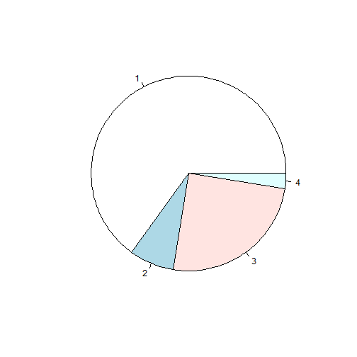
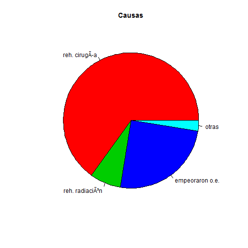
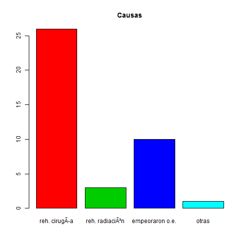
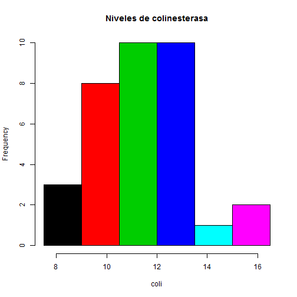
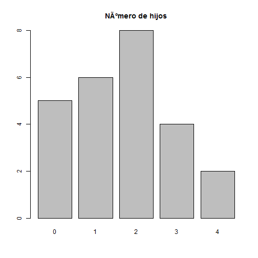
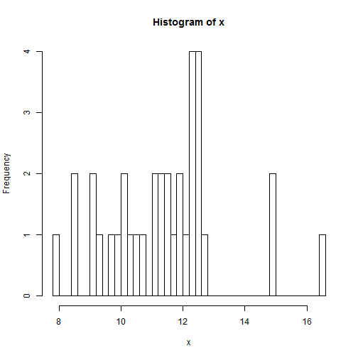
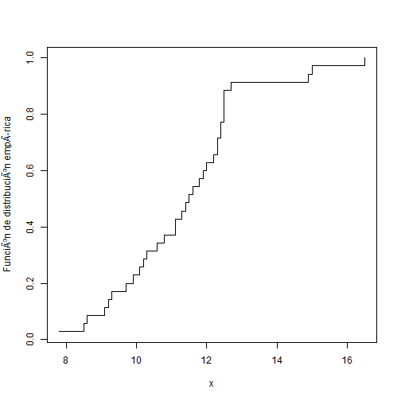

# Representaciones gráficas
===

Dependiendo del tipo de datos que tengamos podemos realizar diferentes representaciones gráficas:

## Datos correspondientes a un carácter cualitativo

Las dos representaciones gráficas habituales para este tipo de datos son el _Diagrama de Sectores_, gráfico que obtendremos don la función __pie()__ y el _Diagrama de Rectángulos_, obtenido con la función __barplot()__.

---
<!--sec data-title="Ejemplo 2.1" data-id="ej2_1 data-show=false" ces-->
#### Ejemplo 2.1

En un estudio sobre las razones por las que no fue completado un tratamiento de radiación seguido de cirugía en pacientes con cáncer de cabeza y cuello se obtuvieron los datos dados por la siguiente distribución de frecuencias absolutas,

| _Causas_ | | $$n_{i}$$ |
| :--: | | :--: |
| Rehusaron cirugía | | 26 |
| Rehusaron radiación | | 3 |
| Empeoraron por una enfermedad ajena al cáncer | | 10 |
| Otras causas | | 1 |
|  | | __40__ |

Para obtener el Diagrama de Sectores,


```r
x <- c(26, 3, 10, 1)
pie(x)
```



Una versión mejorada, sería,

 

```r
# Creamos un vector con los nombres de los sectores
names <- c("reh. cirugía", "reh. radiación", "empeoraron o.e.", "otras")
# Creamos un vector con los colores
colors <- c(2, 3, 4, 5)
pie(x, labels = names, col = colors, main = "Causas")
```



Para obtener el _Diagrama de Rectángulos_,

```r
barplot(x, names.arg = names, col = colors, main = "Causas")
```



Obsérvese que lo único que cambia respecto a la función __pie()__, es que __labels__ no es argumento de la función __barplot()__ sino que, como puede verse, el argumento correspondiente para añadir nombres a las clases, es __names__.

---

## Datos correspondientes a un carácter cuantitativo agrupado en intervalos

Esta situación rara vez se presenta en Estadística porque la agrupación en intervalos implica pérdida de información: todos los datos del intervalo son tratados de igual manera al ser asimilados a la marca de clase, independientemente de los valores reales que tomaran. La razón fundamental de su uso hasta nuestros días, fue la complejidad de manejar grandes cantidades de datos, problema resuelto con el uso habitual de ordenadores. Por tanto, el agrupar datos es una opción no recomendada. Como es posible, no obstante, que en algunas ocasiones los datos los tengamos en intervalos, vamos a indicar como representarlos.

La representación habitual es el _Histograma_ ejecutada con la función __hist()__ aunque veremos que esta función está pensada para datos sin agrupar.

<!--endsec-->
---
<!--sec data-title="Ejemplo 2.2" data-id="ej2_2 data-show=false" ces-->
#### Ejemplo 2.2

Se midieron los niveles de colinesterasa en un recuento de eritrocitos de 34 agricultores expuestos a insecticidas agrícolas, obteniéndose los siguientes datos agrupados en intervalos:


| $$I_{i}$$ | | $$n_{i}$$ |
| :--: | | :--: |
| 7.5 - 9 | | 3 |
| 9 - 10.5 | | 8 |
| 10.5 - 12 | | 10 |
| 12 - 13.5 | | 10 |
| 13.5 - 15 | | 1 |
| 15.5 - 16.5 | | 2 |
|    | | __34__ |


```r
#Creamos un vector con las marcas de clase
m <- c(8.25, 9.75, 11.25, 12.75, 14.25, 15.75)
#Creamos un vector con las frecuencias absolutas
freq <- c(3, 8, 10, 10, 1, 2)
#Replicamos las marcas de clase
coli <- rep(m, freq)
#Puntos de corte
breaks <- c(7.5, 9, 10.5, 12, 13.5, 15, 16.5)
#Vector con los colores de los rectángulos
colors <- c(1, 2, 3, 4, 5, 6)
hist(coli, breaks = breaks, col = colors,
     main = "Niveles de colinesterasa")
```



<!--endsec-->

---


## Datos correspondientes a un carácter cuantitativo sin agrupar en intervalos

Ésta es la situación habitual que tendremos para un conjunto de datos cuantitativos. Las representaciones gráficas habituales serán, el _Diagrama de barras_ si son pocos los valores distintos de la variable o el _Histograma_ si ha muchos valores distintos. Además, en el caso de frecuencias acumuladas la representación gráfica será el _Diagrama de Frecuencias Acumuladas_, denominado _Función de distribución empírica_ si las frecuencias acumuladas a representar son relativas.

---
<!--sec data-title="Ejemplo 2.3" data-id="ej2_3 data-show=false" ces-->
#### Ejemplo 2.3

Tras encuestar a 25 familias sobre el número de hijos que tenían, se obtuvieron los siguientes datos,

| $$X_{i}$$ | | $$n_{i}$$ |
| :--: | | :--: |
| 0 | | 5 |
| 1 | | 6 |
| 2 | | 8 |
| 3 | | 4 |
| 4 | | 2 |
|    | | __25__ |

Como el número de valores distintos de variable es sólo cinco, la representación gráfica que procede es el diagrama de barras.


```r
# Valores posibles
x <- c(0, 1, 2, 3, 4)
# Frecuencias 
freq <- c(5, 6, 8, 4, 2)
barplot(freq, names = x, main = "Número de hijos")
```



<!--endsec-->
---


<!--sec data-title="Ejemplo 2.4" data-id="ej2_4 data-show=false" ces-->

#### Ejemplo 2.4

Se midieron los niveles de colinesterasa en un recuento de eritrocitos de 34 agricultores expuestos a insecticidas agrícolas, obteniéndose los siguientes datos:

10.6, 12.5, 11.1, 9.2, 11.5, 9.9, 11.9, 11.6, 14.9, 12.5, 12.5, 12.5, 12.3, 12.2, 10.8, 16.5, 15, 10.3, 12.4, 9.1, 7.8, 11.3, 12.3, 9.7, 12, 11.8, 12.7, 11.4, 9.3, 8.6, 8.5, 10.1, 12.4, 11.1, 10.2

A continuación mostramos como representar un histograma con los datos de arriba,


```r
x <- c(10.6, 12.5, 11.1, 9.2, 11.5, 9.9, 
       11.9, 11.6, 14.9, 12.5, 12.5, 12.5,
       12.3, 12.2, 10.8, 16.5, 15, 10.3, 
       12.4, 9.1, 7.8, 11.3, 12.3, 9.7, 12,
       11.8, 12.7, 11.4, 9.3, 8.6, 8.5, 10.1,
       12.4, 11.1, 10.2)
hist(x)
```


Si queremos controlar los intervalos del histograma podemos fijar simplemente _breaks = n_ y el ordenador suele elegir un número de intervalos similar a _n_.


```r
x <- c(10.6, 12.5, 11.1, 9.2, 11.5, 9.9, 
       11.9, 11.6, 14.9, 12.5, 12.5, 12.5,
       12.3, 12.2, 10.8, 16.5, 15, 10.3, 
       12.4, 9.1, 7.8, 11.3, 12.3, 9.7, 12,
       11.8, 12.7, 11.4, 9.3, 8.6, 8.5, 10.1,
       12.4, 11.1, 10.2)
n <- length(x)
hist(x, breaks = n)
```



La función de distribución empírica se obtiene con la siguiente combinación de funciones:


```r
n <- length(x)
plot(x =sort(x),y = (1:n)/n, type = "s", xlab = "x",
     ylab = "Función de distribución empírica")
```



Obsérverse que hemos ordenado los datos con la función __sort()__ y hemos encontrado la distribución de frecuencias relativas acumuladas como (1:n)/n. 

<!--endsec-->

