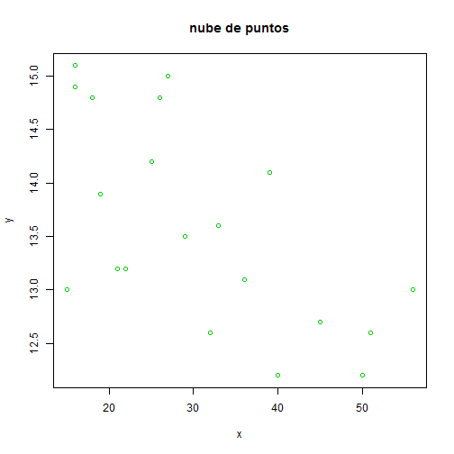
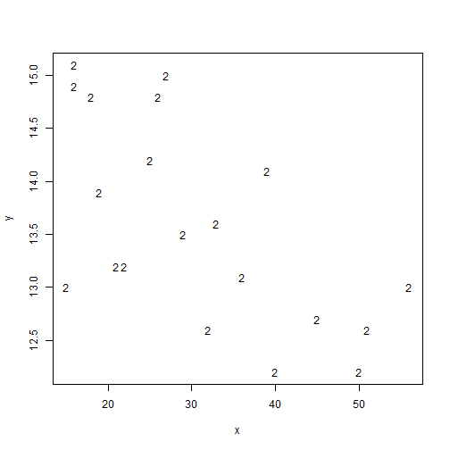
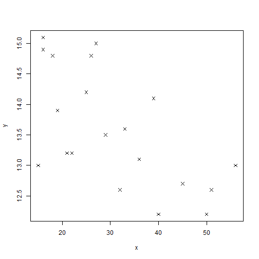
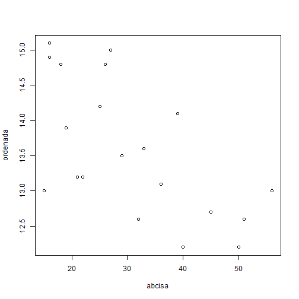
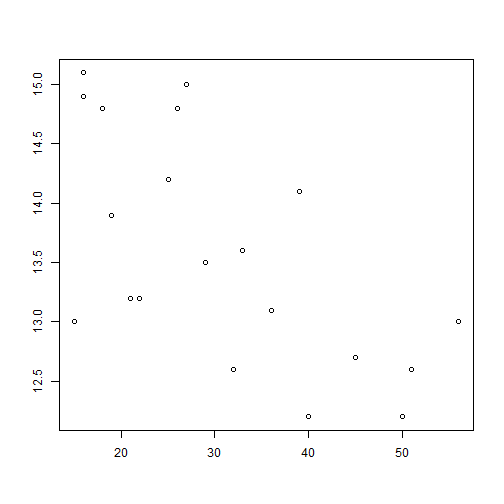
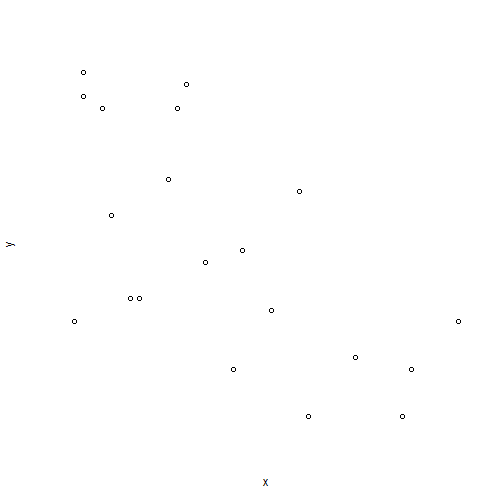
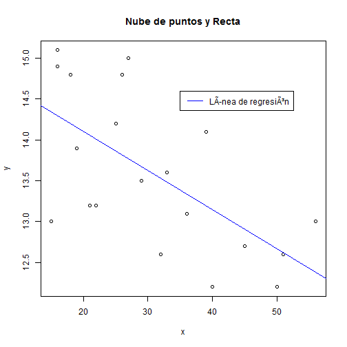

# Datos bidimensionales

Analizaremos aquí las representaciones gráficas de pares de datos. En concreto, la forma de representar un _Diagrama de Dispersión_, también denominado __Nube de puntos__ con la función __plot__ analizando alguna de sus muchas posibilidades, así como la manera de representar sobre ella la recta de regresión o mínimos cuadrados.

Una característica relacionada con la bondad de ajuste de esta recta a los datos que forman la nube de puntos es el _Coeficiente de correlación lineal de Pearson_. Éste se calcula con la función __cor__.

---
### Ejemplo 2.4

Tras preguntar a 20 personas con aficiones atléticas la marca que poseían en 100 metros lisos y las horas semanales que, por término medio, dedicaban a entrenar se obtuvieron los siguientes datos

Horas |  21     32     15     40     27     18     26     50     33     51 
.-------------------------------------------------------------------------
Marca |  13.2  12.6    13    12.2   15    14.8    14.8   12.2   13.6   12.6

Horas |  36     16     19     22     16     39     56     29     45     25 
.-------------------------------------------------------------------------
Marca |  13.1  14.9    13.9  13.2   15.1  14.1    13     13.5   12.7   14.2

Si queremos representar estos pares de datos __(x,y)__ debemos utilizar la función __plot(x,y)__:


```r
x <- c(21, 32, 15, 40, 27, 18, 26, 50, 33, 51, 36, 16,
       19, 22, 16, 39, 56, 29, 45, 25)
y <- c(13.2, 12.6, 13, 12.2, 15, 14.8, 14.8, 12.2, 
       13.6, 12.6, 13.1, 14.9, 13.9, 13.2, 15.1, 14.1, 
       13, 13.5, 12.7, 14.2)
plot(x, y)
```


A continuación mostramos los diferentes argumentos de la función:


```r
#Pone titulo y color a los puntos

plot(x, y, main = "nube de puntos", col=3)
```




```r
#Limita el recorrido del gráfico

plot(x, y, xlim = range(x), ylim = range(y))
```


```r
#Pone los puntos como un 2

plot(x, y, pch ="2")
```




```r
#Pone los puntos como el símbolo x. Hay del 0 al 18

plot(x, y, pch = 4)
```




```r
#Pone nombre a los ejes

plot(x, y, xlab = "abcisa", ylab = "ordenada")
```




```r
#No pone ningún nombre a los ejes

plot(x, y, xlab = "", ylab = "")
```




```r
#No pone el marco al gráfico

plot(x, y, axes = F)
```



Como sabemos, un elemento muy asociado a esta clase de datos es su recta de mínimos cuadrados o de regresión. Podemos obtenerla ejecutando la función __lm__. 


```r
ajus <- lm(y ~ x)
ajus
```

```
## 
## Call:
## lm(formula = y ~ x)
## 
## Coefficients:
## (Intercept)            x  
##    15.05908     -0.04786
```
Obsérverse que hemos obtenido la recta punto-pendiente con ordenada en el origen 15,06 y pendiente -0.048.

Podemos ahora añadirla sin más a la nube de puntos:


```r
plot(x, y, main = "Nube de puntos y Recta")
abline(ajus, col=4)
legend(35, 14.6, c("Línea de regresión"), lty = c(1), col=4)
```



Como dijimos más arriba si queremos calcular el valor del coeficiente de correlación lineal de Pearson, relacionado con la precisión del ajuste de mínimos cuadrados efectuado, ejecutamos:


```r
cor(x, y)
```

```
## [1] -0.6304069
```

