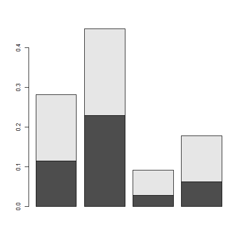
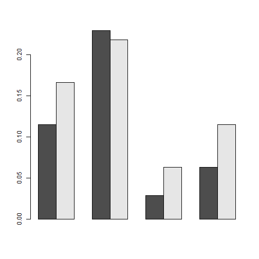
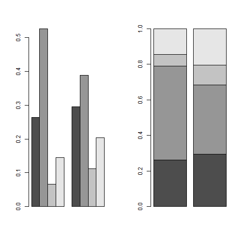
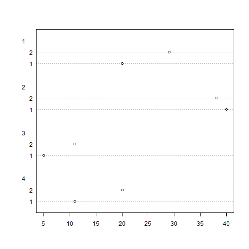

# Tabla de datos

En ocasiones los datos bidimensionales vienen recogidos en tablas de doble entrada porque las variables toman unos pocos valores dintintos y el número total de datos es grande.

---
#### Ejemplo 2.5

Se clasificarón 174 individuos de acuerdo con _Sexo_ y su _Estado Civil_, obteniéndose la siguiente tabla:

|    | | Est. civil | | Soltero | | Casado | | Viudo | | Separado ó Divorciado |
| :--: | | :--: | | :--: | | :--: | | :--: | | :--: | | :--: |
| Sexo | |   | |   | |    | |   | |   | 
| Masculino | | 20 | | 40 | | 5 | | 11 |
| Femenino | | 29 | | 38 | | 11 | | 20 |

Este tipo de datos es tratado por R como una matriz, por lo que primero los incorporaremos, 

```r
> poblacion <- matrix(c(20, 29, 40, 38, 5, 11, 11, 20), ncol = 4)
> `dimnames<-`(poblacion, list(c("Masculino", "Femenino"), 
+                              c("Soltero", "Casado", "Viudo", "Sep/Div")))
```

```
          Soltero Casado Viudo Sep/Div
Masculino      20     40     5      11
Femenino       29     38    11      20
```

De esta distribución bidimensional de frecuencias absolutas se puede obtener rápidamente la distribución bidimensional de frecuencias relativas con la función __prop.table__:


```r
> prop.table(poblacion)
```

```
          [,1]      [,2]       [,3]       [,4]
[1,] 0.1149425 0.2298851 0.02873563 0.06321839
[2,] 0.1666667 0.2183908 0.06321839 0.11494253
```

Las distribuciones marginales absolutas se obtienen con la función __margin.table__. El primer argumento de esta función es la tabla de doble entrada; el segundo argumento sirve para indicar que queremos que lo haga por filas (poniendo un 1) o por columna (poniendo un 2).


```r
> margin.table(poblacion, 1)
```

```
[1] 76 98
```

```r
> margin.table(poblacion, 2)
```

```
[1] 49 78 16 31
```

Las distribuciones marginales relativas se podrán obtener, lógicamente, de dos maneras: bien obteniendo las frecuencias relativas primero y luego las marginales, o al revés. Por ejemplo, en el caso de que queramos obtener la distribución de frecuencias relativas de Sexo, la podríamos obtener por cualquiera de las dos siguientes maneras,


```r
> margin.table(prop.table(poblacion),1)
```

```
[1] 0.4367816 0.5632184
```

```r
> prop.table(margin.table(poblacion, 1))
```

```
[1] 0.4367816 0.5632184
```
Al ser variables que forman la tabla de tipo cualitativo o de tipo cuantitativo pero, en este caso, con valores aislados, la representación gráfica que correspondería sería el diagrama de barras o rectángulos, por lo que será la función __barplot__ la que debemos utilizar. Ésta ya entiende que se trata de una matriz a representar y hace un diagrama para cada uno de los valores de las filas, agrupados por los valores de la variable que aparece en las columnas de la matriz.

Podemos optar porque los haga sobrepuestos unos a otros (opción tomada por defecto):


```r
> barplot(prop.table(poblacion))
```




O bien, que lo haga pegados unos a otros, en cuyo caso deberemos utilizar el argumento __beside=T__:


```r
> barplot(prop.table(poblacion), beside = TRUE)
```



Si queremos que el gráfico sea de los valores de las columnas, agrupados por los valores de la variable que aparece en las filas, debemos trasponer la matriz que se utiliza como primer argumento de la función:


```r
> par(mfrow=c(1,2))
> barplot(prop.table(t(poblacion),2), beside = TRUE)
> barplot(prop.table(t(poblacion), 2))
```



```r
> par(mfrow=c(1,1))
```
Obsérvese que hemos utilizado la función __par(mforw=c(1,2))__. Esta función permite dividir la pantalla gráfica en un sola mátriz de gráficos de dimensión a x b. Si queremos volver a la situación anterior de pantalla completa, deberemos ejecutar __par(mforw=c(1,1))__. Esta posibilidad es válida antes de cualquier gráfico R.

Un gráfico que nos permite visualizar los datos de la tabla, equivalente al diagrama de barras con la opción __beside=TRUE__ es el Diagrama de puntos, obtenido con la función __dotchart__. Así si, ejecutamos


```r
> dotchart(poblacion)
```



obtenemos el siguiente diagrama el cual vemos es muy similar al diagrama de barras pegadas, girado 90 grados y donde están intercambiadas las barras de los sexos.


